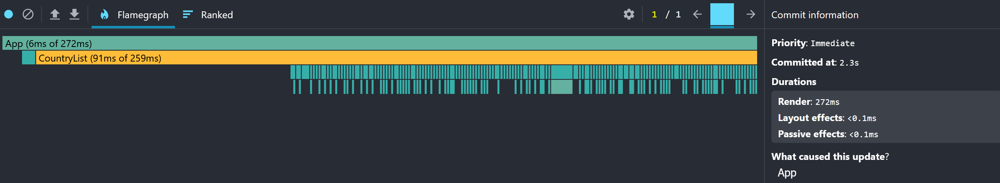
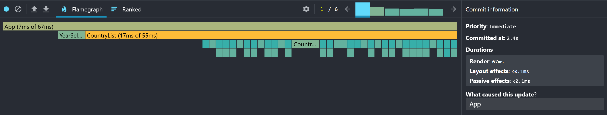
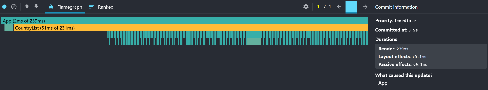
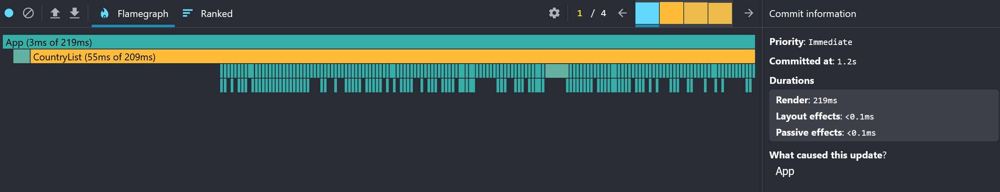

# Performance Optimization Report

ATTENTION: in current profiler there is no such metric as Commit duration, so it was replaced to something with similar meaning: Layout effects duration, Passive effects duration. And also added Committed add.

## Baseline Measurements

### Interaction A: Sort countries

- **Committed add**: 2.3 s
- **Render duration**: 272 ms
- **Layout effects duration**: 0.1 ms
- **Passive effects duration**: 0.1 ms
- **Screenshot**: 

### Interaction B: Search countries

- **Committed add**: 2.4 s
- **Render duration**: 67 ms
- **Layout effects duration**: 0.1 ms
- **Passive effects duration**: 0.1 ms
- **Screenshot**: 

### Interaction C: Change year

- **Committed add**: 3.9 s
- **Render duration**: 239 ms
- **Layout effects duration**: 0.1 ms
- **Passive effects duration**: 0.1 ms
- **Screenshot**: 

### Interaction D: Toggle column

- **Committed add**: 1.2 s
- **Render duration**: 219 ms
- **Layout effects duration**: 0.1 ms
- **Passive effects duration**: 0.1 ms
- **Screenshot**: 